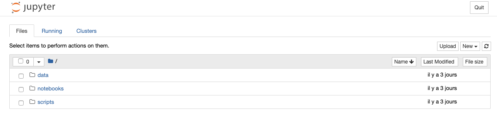

Notebook
==================================================

After starting the blueprint's environment, you will have an access to Jupyter notebooks. The default port used for the interface
is 8888. You can configure the default port value thanks to the file ``cookiecutter.json``.

Mapping folders
################
When the environment is started, it is automatically mapped with your local folders so that in the Jupyter interface,
you you will see the following folders:

- ``notebooks``, that is mapped with the ``notebooks`` folder of your project
- ``scripts``, that is mapped with the ``scripts`` folder of your project
- ``data``, that is mapped with the ``data`` folder of your project

That said, you will be able to launche the Juypter interface, create your notebooks and scripts, and theyr will automatically
be saved in your project. Therefore, there is no need to export any notebook or Python code. You can safely save your workspace
to Github.

Working with passwords
########################
It is often recommended to secure the Jupyter interface with a password or a token. The purpose of theis blueprint is to
provide you with a coding environment. As I expect that you will be the single user of this environment, I have
suggested that you wouldn't require any password. Though, it is possible to activate a password to your Jupyter interface.

To activate the password, you can update the default password value (currently set to null) in the file ``cookiecutter.json``.
When installing the blueprint, you will also be prompted whether or not you wish to use a password for your notebooks. At this
point of the installation, you can also set a password.

Working with your packaged project
########################################
Every time you start your environment, your project will be packaged and deployed in the environment. It is then made possible
to import your project in your notebooks, and work with as if you had installed a new dependency.

You can then add some code to your project, and live test it in your notebooks. As you update your code, its packaged version
in your notebooks will automatically be updated. The only limitation is that Jupyter takes a snapshot of your Python environment
status when it loads its workspace. Therefore, if you update your project code, you will need to reload your notebook's workspace, and rerun
the cells.