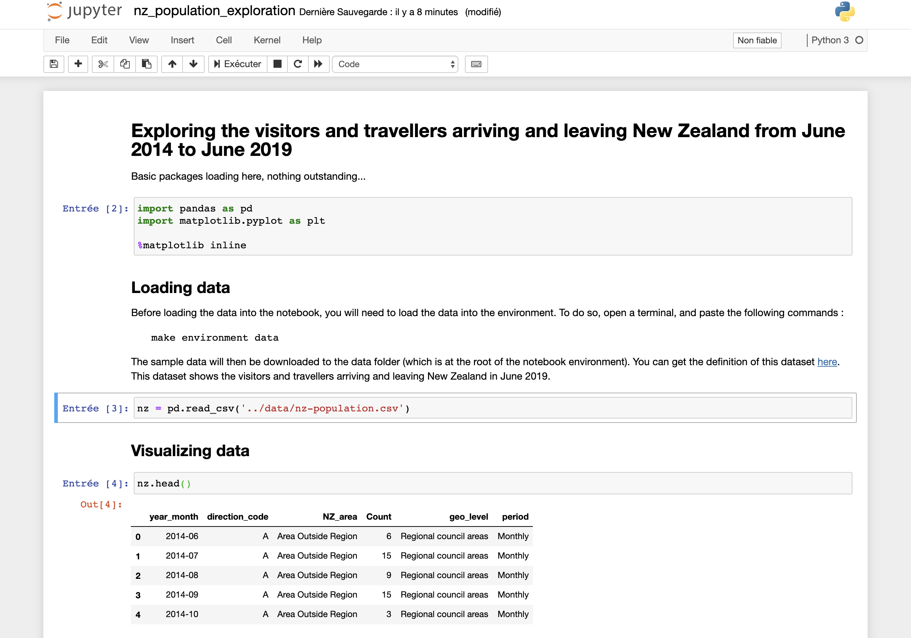

Environment
==================================================

Build the environment
########################
After the blueprint is installed, most of what you will do with your environment will work through the ``make`` command.
You can build your environment like this::

        $ make environment-build

You should see the following output::

        Successfully built c70c2ec13421
        Successfully tagged awesome-project-env:latest

        Environment is built! A Docker image was created: awesome-project-env

Let's add some sample data to our project::

        $ make environment-data

You can now start your environment::

        $ make environment-start

You should see the following output::

        05f32052868110f38e8233a2ac70ebff076272c7997f5409a8d70a780fc33ec7
        Environment is running!
        Notebooks interface is available at http://localhost:8082

Use the Jupyter interface
############################
You can now reach out to your environment interface, and access the Jupyter notebook instance. A notebook has been
created with the blueprint, to give you a sample exploration. It is located in the notebooks folder. After displaying it,
you can run the cells.

Work with the shell
########################
Back to your terminal, you can now launch a shell::

        $ make environment-shell

You are now in the shell, and you will notice that the prompt has changed::

        jovyan@awesome_project:~$

Move to the scripts folder, and launch a python script that tests your package::

        jovyan@awesome_project:~$ cd scripts
        jovyan@awesome_project:~/scripts$ python3 nz-mapping.py

This is the output you should expect::

                       NZ_area  Count               geo_level
        0  Area Outside Region      6  Regional council areas
        1  Area Outside Region     15  Regional council areas
        2  Area Outside Region      9  Regional council areas
        3  Area Outside Region     15  Regional council areas
        4  Area Outside Region      3  Regional council areas

                       NZ_area  Count               geo_level
        0  area outside region      6  REGIONAL COUNCIL AREAS
        1  area outside region     15  REGIONAL COUNCIL AREAS
        2  area outside region      9  REGIONAL COUNCIL AREAS
        3  area outside region     15  REGIONAL COUNCIL AREAS
        4  area outside region      3  REGIONAL COUNCIL AREAS

